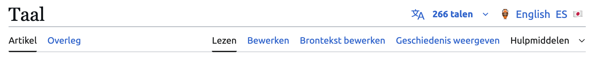

# Wikipedia Language Switcher

**Wikipedia Language Switcher** is a Firefox add-on that allows multilingual users to quickly switch between different language versions of the same Wikipedia article. It enhances the Wikipedia interface by adding a customizable row of language shortcuts next to the native language selector.

## Features

- 🔀 Quickly switch between language editions of any article when they are available
- 🌐 Configure your preferred languages using WP language codes (e.g., `en`, `es`, `zh`)
- 🏷️ Choose how languages are displayed:
  - Full native language names
  - WP language codes (in uppercase)
  - Custom labels (e.g. emoji, abbreviations, etc.)
- 🌍 Fully localized into 30+ of the world’s most widely spoken languages
- 🛠️ Simple interface for managing and customizing language preferences

## How to Use

1. Install the extension in Firefox.
2. Go to the extension’s settings page.
3. Enter your preferred languages using WP codes, separated by commas (e.g., `en, es, fr, zh`).
4. Select your desired display mode: native names, WP codes, or custom labels.
5. (Optional) If using custom labels, enter your preferred label for each language in the provided fields.

## Example

## Credits

This project is a heavily enhanced fork of [WikipediaQuickLanguages](https://github.com/LeonGr/WikipediaQuickLanguages) by [@LeonGr](https://github.com/LeonGr), originally licensed under the GNU GPL v3.0.

## License

This extension is licensed under the [GNU General Public License v3.0](./LICENSE).
